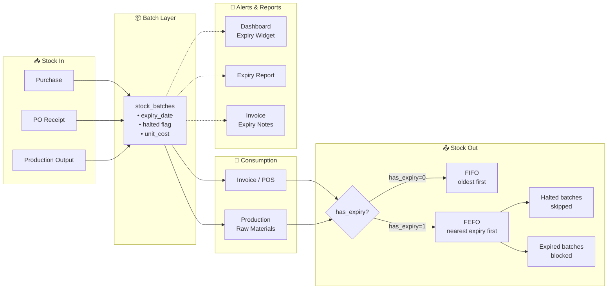
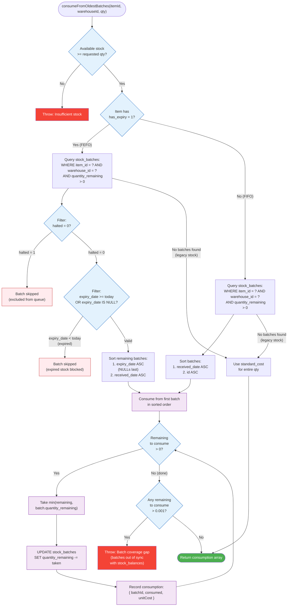

# Item Expiry Date Tracking — Specification

**Date:** 2026-08-20  
**Status:** Draft  
**Scope:** Full-stack (database → server → Flutter frontend)

---

## 1. Overview

Add per-batch expiry date tracking to items so that perishable goods can be managed with First-Expiry-First-Out (FEFO) consumption. The system already tracks batches (`stock_batches`) with FIFO consumption. This feature extends that with expiry dates, a halt mechanism for individual batches, configurable near-expiry thresholds, proactive alerts, and expiry information surfaced on invoices and reports.

**Key decisions:**
- Expiry date lives **per-batch** (not per-item), since different purchase lots of the same item have different expiry dates.
- Items have an opt-in `has_expiry` flag — items like electronics or stationery skip all expiry logic.
- Consumption switches from FIFO to **FEFO** for items with expiry tracking. Items without expiry continue using FIFO.
- Batches can be **halted** (flag on batch) to exclude them from automatic FEFO consumption. Halted batches can be **unhalted**.
- Expiry date is **editable anytime** — at entry (purchase/receipt/production) or retroactively.

### High-Level Flow



---

## 2. Database Schema Changes

### 2.1 `items` table — add 2 columns

```sql
ALTER TABLE items ADD COLUMN has_expiry BOOLEAN DEFAULT 0;
ALTER TABLE items ADD COLUMN near_expiry_threshold_days INTEGER DEFAULT 30;
```

| Column | Type | Default | Description |
|--------|------|---------|-------------|
| `has_expiry` | BOOLEAN | 0 | Whether this item tracks expiry dates. 0 = skip all expiry logic. |
| `near_expiry_threshold_days` | INTEGER | 30 | Number of days before expiry to flag a batch as "near-expiry". Configurable per-item. |

### 2.2 `stock_batches` table — add 3 columns

```sql
ALTER TABLE stock_batches ADD COLUMN expiry_date DATE;
ALTER TABLE stock_batches ADD COLUMN halted BOOLEAN DEFAULT 0;
ALTER TABLE stock_batches ADD COLUMN halted_reason TEXT;
```

| Column | Type | Default | Description |
|--------|------|---------|-------------|
| `expiry_date` | DATE | NULL | The expiry date of this batch. NULL means no expiry. |
| `halted` | BOOLEAN | 0 | Whether this batch is excluded from automatic FEFO consumption. |
| `halted_reason` | TEXT | NULL | Free-text reason why the batch was halted. |

### 2.3 `purchase_order_items` table — add 1 column

```sql
ALTER TABLE purchase_order_items ADD COLUMN expiry_date DATE;
```

This allows the user to enter an expiry date when creating/editing a PO. The value flows into `stock_batches.expiry_date` when the goods receipt is created.

### 2.4 `productions` table — add 1 column

```sql
ALTER TABLE productions ADD COLUMN expiry_date DATE;
```

For produced items that have expiry tracking (e.g., manufactured food products). Flows into the output batch on production completion.

### 2.5 `invoices` table — add `override_sale` column

```sql
ALTER TABLE invoices ADD COLUMN override_sale INTEGER DEFAULT 0;
```

| Column | Type | Default | Description |
|--------|------|---------|-------------|
| `override_sale` | INTEGER | 0 | Whether this invoice was created via an expired batch override sale. Set to 1 when the user confirms selling expired stock through the override dialog. |

**Why a separate flag instead of relying on `expiry_notes`?**
The `expiry_notes` field is populated based on batch expiry at creation time. An override sale clears the batch expiry before selling, so `expiry_notes` may not indicate the override. The `override_sale` flag provides a definitive record that the sale bypassed the normal FEFO expiry block.

### 2.6 `purchases` table — no schema change needed

Direct purchases already create a batch. The expiry date will be entered via the purchase form and passed through to the batch creation.

### 2.6 New indexes

```sql
CREATE INDEX idx_stock_batches_expiry ON stock_batches(expiry_date) WHERE expiry_date IS NOT NULL;
CREATE INDEX idx_stock_batches_halted ON stock_batches(halted) WHERE halted = 1;
CREATE INDEX idx_items_has_expiry ON items(has_expiry);
```

---

## 3. Server-Side Changes

### 3.1 Batch Creation — pass expiry_date through

All code paths that create `stock_batches` rows must accept and store an optional `expiry_date`:

| Code path | File | Method |
|-----------|------|--------|
| Direct purchase | `Purchase.ts` | `recordPurchase()` |
| PO goods receipt | `PurchaseOrder.ts` | `addReceipt()` |
| Production output | `Production.ts` | `recordProduction()` |

Each method already creates a batch row. Add `expiry_date` to the INSERT statement:

```sql
INSERT INTO stock_batches (
  batch_no, item_id, warehouse_id, source_type,
  source_id, quantity_original, quantity_remaining,
  unit_cost, received_date, expiry_date, halted
) VALUES (?, ?, ?, ?, ?, ?, ?, ?, ?, ?, 0)
```

### 3.2 FEFO Consumption — replace FIFO ordering

**File:** `server/src/models/StockMovement.ts` → `consumeFromOldestBatches()`

Current query:
```sql
SELECT id, quantity_remaining, unit_cost
FROM stock_batches
WHERE item_id = ? AND warehouse_id = ? AND quantity_remaining > 0
ORDER BY received_date ASC, id ASC
```

New query for items with `has_expiry = 1`:
```sql
SELECT id, quantity_remaining, unit_cost
FROM stock_batches
WHERE item_id = ? AND warehouse_id = ? AND quantity_remaining > 0
  AND halted = 0
  AND (expiry_date IS NULL OR expiry_date >= date('now'))
ORDER BY
  CASE WHEN expiry_date IS NULL THEN 1 ELSE 0 END,
  expiry_date ASC,
  received_date ASC,
  id ASC
```

For items with `has_expiry = 0`, keep the existing FIFO query (no halted/expiry filtering).

**Logic change:** The method needs to know whether the item has expiry tracking. Add an `itemHasExpiry` parameter or query it from the `items` table.

```typescript
static consumeFromOldestBatches(
  itemId: number,
  warehouseId: number,
  quantity: number,
  db: Database.Database
): Array<{ batchId: number | null; consumed: number; unitCost: number }> {
  // Check if item has expiry tracking
  const item = db.prepare('SELECT has_expiry FROM items WHERE id = ?').get(itemId) as { has_expiry: number } | undefined;
  const useFEFO = item?.has_expiry === 1;

  // ... existing validation (available qty check) ...

  const batches = db.prepare(`
    SELECT id, quantity_remaining, unit_cost
    FROM stock_batches
    WHERE item_id = ? AND warehouse_id = ? AND quantity_remaining > 0
      ${useFEFO ? "AND halted = 0 AND (expiry_date IS NULL OR expiry_date >= date('now'))" : ''}
    ORDER BY
      ${useFEFO ? `
        CASE WHEN expiry_date IS NULL THEN 1 ELSE 0 END,
        expiry_date ASC,
      ` : ''}
      received_date ASC,
      id ASC
  `).all(itemId, warehouseId) as Array<{
    id: number;
    quantity_remaining: number;
    unit_cost: number;
  }>;

  // ... rest of existing logic ...
}
```

**Important:** When a batch has a NULL `expiry_date` and the item uses FEFO, it should be consumed *after* batches with an expiry date. This prevents unknown-expiry stock from being consumed first.

### 3.3 Halted Batch Warning

When `consumeFromOldestBatches` encounters halted batches that were skipped, it should log a warning but not throw. The existing error path (insufficient stock after skipping halted batches) should mention halted batches in the error message.

### 3.4 Batch Halt/Unhalt API

New endpoints:

```
PATCH /api/stock-batches/:id/halt   — sets halted=1, halted_reason from body
PATCH /api/stock-batches/:id/unhalt — sets halted=0, clears halted_reason
```

Both require `inventory` write permission. Both should be wrapped in a transaction.

### 3.5 Batch Expiry Update API

New endpoint:

```
PATCH /api/stock-batches/:id — updates expiry_date (and optionally halted/halted_reason)
```

The existing batch list/detail endpoints should include the new fields in their response.

### 3.6 Items CRUD — add expiry fields

**Create/Update item endpoints** must accept `has_expiry` and `near_expiry_threshold_days`:

- `POST /inventory/items` — add both fields
- `PUT /inventory/items/:id` — add both fields
- `GET /inventory/items/:id` — include both fields in response
- Validation: `near_expiry_threshold_days` must be a positive integer (or NULL).

### 3.7 Purchase/PO/Production — pass expiry_date

| Endpoint | Change |
|----------|--------|
| `POST /purchases` | Accept optional `expiry_date` → pass to `recordPurchase()` |
| `PUT /purchase-orders/:id/items` | Accept optional `expiry_date` per item → store on PO item |
| `POST /purchase-orders/:id/receipts` | Read `expiry_date` from the PO item → pass to `addReceipt()` → into batch |
| `POST /productions` | Accept optional `expiry_date` → pass to `recordProduction()` → into output batch |

### 3.8 Expiry Report — new endpoint

```
GET /api/reports/expiry?warehouse_id=&threshold_days=&status=near_expiry|expired|all
```

Returns batches grouped by item, sorted by expiry_date ASC. Filters:
- `threshold_days`: override the item's `near_expiry_threshold_days`
- `status`: `expired` (expiry_date < today), `near_expiry` (expiry_date between today and today+threshold), `all`

### 3.9 Dashboard Expiry Alert — new endpoint

```
GET /api/dashboard/expiry-alerts?days=30
```

Returns top-N batches expiring within `days`, grouped by item. Used by the dashboard widget.

### 3.10 Invoice Expiry Info

**File:** `server/src/models/Invoice.ts`

When an invoice is created (via `createInvoice` or `createFromSalesOrder`), the FIFO consumption already returns `batchId` per consumed entry. After consumption:

1. Look up `expiry_date` from the consumed batch.
2. If the batch is expired, compute `days_expired = today - expiry_date`.
3. Attach `{ expiry_date, is_expired, days_expired }` metadata to each invoice item line.

**Invoice detail response** (`getById`) — join to a new `invoice_item_batches` table (see 3.11) or store expiry metadata on `invoice_items`.

### 3.11 Invoice Item Expiry Metadata

Add columns to `invoice_items`:

```sql
ALTER TABLE invoice_items ADD COLUMN expiry_date DATE;
ALTER TABLE invoice_items ADD COLUMN is_expired_at_sale BOOLEAN DEFAULT 0;
```

This denormalizes the expiry info so it's preserved even if batch data changes. Populated at invoice creation time from the consumed batch.

### 3.12 Invoice Expiry Notes — separate column (not `invoices.notes`)

Add a dedicated column to `invoices`:

```sql
ALTER TABLE invoices ADD COLUMN expiry_notes TEXT;
```

**Why a separate column instead of appending to `invoices.notes`?**

| Concern | Appending to `notes` | Separate `expiry_notes` column |
|---------|---------------------|-------------------------------|
| User notes preservation | ⚠️ Risk of overwrite/loss on edit | ✅ User `notes` stays untouched |
| Content separation | ⚠️ Mixes system + user text | ✅ Clean separation |
| Re-safety | ⚠️ Duplicate entries on re-save | ✅ System-managed, not user-editable |
| Queryability | ⚠️ Must regex-parse for expiry info | ✅ Simple column check |
| Audit trail | ⚠️ Hard to distinguish source | ✅ Clear: this column is system-generated |

**Population logic:** When an invoice is created (direct, from SO, or via POS), after FIFO/FEFO consumption:

1. For each invoice item, look up the consumed batch's `expiry_date` and `is_expired_at_sale` from `invoice_items`.
2. If *any* line has `is_expired_at_sale = 1`, build the `expiry_notes` string:

```
⚠️ Expiry Notice
• [Item Name] — expired on DD/MM/YYYY (sold X days after expiry)
• [Item Name] — expired on DD/MM/YYYY (sold Y days after expiry)
```

3. If no lines are expired but some are near-expiry (within item's `near_expiry_threshold_days`):

```
ℹ️ Near-Expiry Notice
• [Item Name] — expires on DD/MM/YYYY (X days remaining)
```

4. If no lines have any expiry concerns, `expiry_notes` remains NULL.

**Override sale support:** The `denormalizeExpiryInfo()` method accepts an optional `expiryOverrides` parameter — a `Record<number, string | null>` mapping batch IDs to their original expiry dates. This is used when the frontend performs an expired batch override:

1. Frontend stashes original expiry dates: `{ batchId: "2026-07-01" }`
2. Frontend clears batch `expiry_date` via API (so FEFO allows consumption)
3. Frontend sends `expired_batch_overrides: { batchId: "2026-07-01" }` in the invoice creation body
4. Server's `denormalizeExpiryInfo` checks the override map when batch `expiry_date` is NULL
5. This ensures `invoice_items.expiry_date`, `is_expired_at_sale`, and `invoices.expiry_notes` are correctly populated even on override sales

```typescript
denormalizeExpiryInfo(
  invoiceId: number,
  consumptions: Array<{ itemId: number; consumption: ConsumptionResult[] }>,
  db: Database.Database,
  expiryOverrides?: Record<number, string | null>  // NEW
): void
```

**Rules:**
- `expiry_notes` is **system-managed** — not exposed in create/update invoice endpoints.
- It's regenerated only at invoice creation time, never on subsequent edits.
- Displayed on the invoice detail dialog and on printed/PDF invoices.
- The Flutter invoice model gets a new `expiryNotes` field.
- `override_sale` is set to `1` when `expired_batch_overrides` is present in the request body.

---

## 4. Flutter Frontend Changes

### 4.1 Item Form — add expiry toggle

**File:** `lib/features/inventory/item_form_dialog.dart`

Add two new fields below the existing "Item Type" section:

1. **"Track Expiry"** — `Switch` or `CheckboxListTile`. Toggles `has_expiry`.
2. **"Near-Expiry Threshold (days)"** — Number field. Only visible when `has_expiry` is true. Defaults to 30.

Update `_buildBody()` to include `has_expiry` and `near_expiry_threshold_days`.

### 4.2 Item Model — add expiry fields

**File:** `lib/data/models/item.dart`

```dart
class Item {
  // ... existing fields ...
  final bool hasExpiry;
  final num? nearExpiryThresholdDays;

  factory Item.fromJson(Map<String, dynamic> json) => Item(
    // ... existing fields ...
    hasExpiry: asBool(json['has_expiry']),
    nearExpiryThresholdDays: asNum(json['near_expiry_threshold_days']),
  );
}
```

### 4.3 Purchase Form — add expiry date field

**File:** `lib/features/purchases/purchase_form_dialog.dart`

In the "Item" section, add an expiry date picker field:

```
Expiry Date (optional)  [📅 Select date]  ← only shown if selected item has expiry
```

The date is passed to `POST /purchases` as `expiry_date`.

### 4.4 PO Item Line — add expiry date field

**File:** `lib/features/purchase_orders/purchase_order_form.dart` (or equivalent PO creation dialog)

Add expiry date picker to each PO item line. The value is stored on `purchase_order_items.expiry_date` and flows into the batch at goods receipt time.

### 4.5 Production Form — add expiry date field

**File:** `lib/features/production/production_form.dart`

Add an optional expiry date field for the output item (only shown when the output item has `has_expiry = true`).

### 4.6 Batch Management Screen — new or enhanced

**New file:** `lib/features/inventory/batch_management_screen.dart`

A dedicated screen (accessible from Inventory → Batches or from item detail) showing all batches for a selected item:

| Column | Description |
|--------|-------------|
| Batch No | Batch identifier |
| Warehouse | Warehouse name |
| Source Type | PURCHASE / PRODUCTION |
| Source Doc | Purchase no / Production no |
| Qty Original | Original quantity |
| Qty Remaining | Current remaining quantity |
| Unit Cost | Cost per unit |
| Received Date | When the batch was received |
| **Expiry Date** | **Editable date picker inline** |
| **Status** | **Normal / Near-Expiry / Expired / Halted** |
| **Actions** | **Edit Expiry / Halt / Unhalt buttons** |

Features:
- Inline expiry date editing (click to edit, saves on blur)
- Halt/Unhalt toggle button per batch
- Color-coded status badges: green (normal), yellow (near-expiry), red (expired), gray (halted)
- Filter by status, warehouse

### 4.7 Stock Batches Model — add expiry fields

**File:** `lib/data/models/stock_batch.dart` (create if doesn't exist, or extend existing batch model)

```dart
class StockBatch {
  // ... existing fields ...
  final DateTime? expiryDate;
  final bool halted;
  final String? haltedReason;

  // Computed
  bool get isExpired => expiryDate != null && expiryDate.isBefore(DateTime.now());
  bool get isNearExpiry {
    // Requires threshold from item, or a default
    if (expiryDate == null) return false;
    final threshold = nearExpiryThresholdDays ?? 30;
    return expiryDate!.difference(DateTime.now()).inDays <= threshold;
  }
}
```

### 4.8 Invoice Detail — show expiry info + override indicator

**File:** `lib/features/invoices/invoice_detail_dialog.dart`

On each invoice item line, if the batch had expiry info:
- Show a small icon (⚠️ or 🕐) next to the item name
- On hover/tap, show: "Expiry: DD/MM/YYYY" and "Sold X days after expiry" if expired

**Override sale indicator:**
- If `invoice.overrideSale == true`, show a prominent ⚠️ **"Override Sale"** badge/card above the expiry notes section
- The badge uses amber/orange styling to indicate this sale bypassed normal FEFO expiry blocking
- This is displayed on:
  - Invoice detail dialog (print preview page)
  - Invoice PDF output (in the expiry notice box)
  - Sales list view (PlutoGrid column with ⚠️ icon + tooltip)
  - CSV export ("Override" column with "Yes" value)

**Invoice expiry_notes section:**
- If `invoice.expiryNotes` is not null, show a prominent warning/info section at the bottom of the invoice detail (separate from user `notes`):
  ```
  ⚠️ Expiry Notice                          ← or ℹ️ Near-Expiry Notice
  • Item X — expired DD/MM/YYYY (sold 5 days after expiry)
  • Item Y — expired DD/MM/YYYY (sold 12 days after expiry)
  ```
- The section uses a styled `Card` with warning/info colors (yellow/orange background).
- `expiryNotes` is read-only — the user cannot edit it from the invoice detail screen.

### 4.9 Dashboard — Expiry Alert Widget

**File:** `lib/features/dashboard/` (add new widget)

New dashboard card: **"Expiring Soon"**

- Shows top 5–10 batches expiring within the configured threshold
- Each row: Item name, batch no, expiry date, days remaining, warehouse
- Color-coded: red if expired, yellow if near-expiry
- Click to navigate to batch management screen for that item
- Uses `GET /api/dashboard/expiry-alerts` endpoint

### 4.10 Expiry Report Screen

**New file:** `lib/features/reports/expiry_report_screen.dart`

A dedicated report screen (Reports → Expiry Report) showing:

| Column | Description |
|--------|-------------|
| Item Code | Item code |
| Item Name | Item name |
| Batch No | Batch identifier |
| Warehouse | Warehouse name |
| Qty Remaining | Current remaining quantity |
| Unit Cost | Cost per unit |
| Total Value | Qty × Cost |
| Received Date | When received |
| **Expiry Date** | **Color-coded (red/yellow/green)** |
| **Status** | **Expired / Near-Expiry / Normal** |
| **Days Until Expiry** | **Computed** |
| **Halted** | **Yes/No badge** |

Filters:
- Warehouse selector
- Status filter: All / Expired / Near-Expiry / Normal
- Threshold days override
- Item category filter

Exportable to CSV.

### 4.11 Batch Traceability Report — add expiry column

**File:** `lib/features/reports/batch_traceability_report_screen.dart`

Add `Expiry Date` and `Status` columns to the existing batch traceability report.

### 4.12 POS / Sales Order — FEFO consumption warning + override flow

**Files:** `lib/features/pos/`, `lib/features/sales/sales_invoice_form_page.dart`

When a sale is being processed and the FEFO-consumed batch is expired or near-expiry:

1. Show a **toast/snackbar warning**: "⚠️ Item [X] is being sold from batch [BATCH-XX] expiring on DD/MM/YYYY"
2. If expired, show a **3-button confirmation dialog**:
   - **Cancel** — abort the sale
   - **Confirm** — proceed with sale (blocks expired batch consumption server-side)
   - **Override & Sell** — clears batch expiry, sells, then restores (see override flow below)
3. The sale proceeds if the user confirms or overrides.

**Expired Batch Override Flow:**

When the user clicks "Override & Sell":

1. **Stash original dates**: Frontend stores `{ batchId: originalExpiryDate }` in `_expiredBatchOverrides` map
2. **Show confirmation**: Snackbar confirms "N batches overridden for this sale"
3. **Clear expiry**: Before posting the invoice, frontend calls `PATCH /stock-batches/:id` to clear `expiry_date` on each overridden batch (so FEFO allows consumption)
4. **Post invoice**: Invoice creation body includes `expired_batch_overrides: { batchId: originalDate }` and `override_sale: true`
5. **Denormalize**: Server's `denormalizeExpiryInfo` uses the override map to populate `expiry_notes` and `is_expired_at_sale` even though batch expiry was cleared
6. **Restore dates**: In a `finally{}` block, frontend restores original `expiry_date` on all overridden batches via `PATCH /stock-batches/:id`

This ensures batch records remain accurate while the invoice correctly reflects the original expiry information.

### 4.13 Item Detail Dialog — batch expiry summary

**File:** `lib/features/inventory/item_detail_dialog.dart`

In the stock-by-warehouse section, show batch summary with expiry status:
- "X batches, Y near-expiry, Z expired"
- Link to batch management screen

---

## 5. Business Rules

### 5.1 FEFO Consumption Order

For items with `has_expiry = 1`:
1. Batches with `halted = 0` and `expiry_date >= today` — sorted by `expiry_date ASC`
2. Batches with `halted = 0` and `expiry_date IS NULL` — sorted by `received_date ASC` (fallback)
3. Batches with `halted = 1` — **excluded** from automatic consumption
4. Batches with `expiry_date < today` — **excluded** from automatic consumption (but available for manual override)

For items with `has_expiry = 0`: existing FIFO behavior, no changes.

### 5.1.1 FEFO Consumption Flow Diagram



**Legend:**
- 🔵 **Blue** = Decision points
- 🟣 **Purple** = Action steps
- 🔴 **Red** = Error/exception paths
- 🟥 **Pink** = Skipped batches (halted or expired)
- 🟢 **Green** = Success/return

### 5.2 Expiry Warning Rules

| Scenario | Behavior |
|----------|----------|
| Selling an expired batch | Confirmation dialog + invoice line note + invoice footer note |
| Selling a near-expiry batch | Toast warning + invoice line note |
| Producing with expired raw material | Confirmation dialog |
| Receiving expired goods (PO receipt) | Warning toast: "Batch for [item] expires on DD/MM/YYYY" |

### 5.3 Batch Halt Rules

- Halted batches remain in inventory (stock_balances not affected)
- Halted batches are excluded from FEFO consumption only
- Halted batches are excluded from the dashboard expiry alert (they're known issues)
- Any user with `inventory` write permission can halt/unhalt
- Halt reason is optional but encouraged
- Unhalting restores the batch to FEFO consumption queue

### 5.4 Expiry Date Edit Rules

- Expiry date can be set or changed on any batch at any time
- Changing expiry date on a halted batch is allowed
- Changing expiry date does not trigger any stock movement or accounting entry
- The expiry date is informational and affects consumption ordering + alerts only

---

## 6. Migration Strategy

### 6.1 Database Migration File

Create `server/src/migrations/add-item-expiry-tracking.sql`:

```sql
-- Item expiry tracking
-- Adds has_expiry flag, near-expiry threshold, batch expiry/halt fields,
-- and PO item expiry date.

-- Items: expiry opt-in and threshold
ALTER TABLE items ADD COLUMN has_expiry BOOLEAN DEFAULT 0;
ALTER TABLE items ADD COLUMN near_expiry_threshold_days INTEGER DEFAULT 30;

-- Stock batches: expiry date and halt mechanism
ALTER TABLE stock_batches ADD COLUMN expiry_date DATE;
ALTER TABLE stock_batches ADD COLUMN halted BOOLEAN DEFAULT 0;
ALTER TABLE stock_batches ADD COLUMN halted_reason TEXT;

-- Purchase order items: expiry date (flows into batch at receipt)
ALTER TABLE purchase_order_items ADD COLUMN expiry_date DATE;

-- Productions: expiry date for output item
ALTER TABLE productions ADD COLUMN expiry_date DATE;

-- Invoice items: denormalized expiry info
ALTER TABLE invoice_items ADD COLUMN expiry_date DATE;
ALTER TABLE invoice_items ADD COLUMN is_expired_at_sale BOOLEAN DEFAULT 0;

-- Invoice header: system-generated expiry summary note
ALTER TABLE invoices ADD COLUMN expiry_notes TEXT;

-- Invoice header: override sale flag
ALTER TABLE invoices ADD COLUMN override_sale INTEGER DEFAULT 0;

-- Indexes
CREATE INDEX IF NOT EXISTS idx_stock_batches_expiry ON stock_batches(expiry_date) WHERE expiry_date IS NOT NULL;
CREATE INDEX IF NOT EXISTS idx_stock_batches_halted ON stock_batches(halted) WHERE halted = 1;
CREATE INDEX IF NOT EXISTS idx_items_has_expiry ON items(has_expiry);
```

### 6.2 Migration Runners

Add `runExpiryTrackingMigration()` to `server/src/config/database.ts` following the existing pattern (check for column existence, run SQL if missing).

Add `runOverrideSaleMigration()` as a separate runner for the `override_sale` column. This is a separate migration because it was added after the initial expiry tracking implementation.

### 6.3 Existing Data

- All existing batches get `expiry_date = NULL`, `halted = 0` — no data loss.
- All existing items get `has_expiry = 0` — no behavior change for existing items.
- Existing FIFO consumption continues to work for all items (no expiry = no FEFO).

---

## 7. Files Affected

### Backend (server/)
| File | Change Type | Description |
|------|-------------|-------------|
| `src/migrations/add-item-expiry-tracking.sql` | **New** | Migration SQL |
| `src/config/database.ts` | Edit | Run migration on startup |
| `src/models/StockMovement.ts` | Edit | FEFO ordering in `consumeFromOldestBatches` |
| `src/models/Purchase.ts` | Edit | Pass `expiry_date` through to batch creation |
| `src/models/PurchaseOrder.ts` | Edit | Pass `expiry_date` from PO item to batch in `addReceipt()` |
| `src/models/Production.ts` | Edit | Pass `expiry_date` to output batch |
| `src/models/Invoice.ts` | Edit | Denormalize expiry onto invoice items, populate `expiry_notes` column, accept `expiryOverrides` param |
| `src/controllers/invoiceController.ts` | Edit | Pass `expired_batch_overrides` and `override_sale` to model |
| `src/migrations/add-override-sale-column.sql` | **New** | Separate migration for `override_sale` column |
| `src/types/index.ts` | Edit | Add expiry fields to `StockBatch`, `Purchase`, etc. |
| `src/controllers/` (multiple) | Edit | Accept `expiry_date` in create/update endpoints |
| `src/routes/` (new or extended) | Edit | Batch halt/unhalt/expiry-update endpoints, expiry report |
| `src/services/Reports.ts` | Edit | Add expiry report query, update batch traceability |

### Frontend (lib/)
| File | Change Type | Description |
|------|-------------|-------------|
| `data/models/item.dart` | Edit | Add `hasExpiry`, `nearExpiryThresholdDays` |
| `data/models/invoice.dart` | Edit | Add `expiryNotes`, `overrideSale` fields to Invoice model, add `expiryDate`/`isExpiredAtSale` to InvoiceItem |
| `data/models/stock_batch.dart` | **New or Edit** | Add `expiryDate`, `halted`, `haltedReason`, computed `isExpired`/`isNearExpiry` |
| `data/repositories/inventory_repository.dart` | Edit | Add batch management API calls |
| `features/inventory/item_form_dialog.dart` | Edit | Add expiry toggle + threshold field |
| `features/inventory/item_detail_dialog.dart` | Edit | Show batch expiry summary |
| `features/inventory/batch_management_screen.dart` | **New** | Batch management screen |
| `features/purchases/purchase_form_dialog.dart` | Edit | Add expiry date picker |
| `features/purchase_orders/` (PO form) | Edit | Add expiry date to PO item lines |
| `features/production/` (production form) | Edit | Add expiry date for output item |
| `features/invoices/invoice_detail_dialog.dart` | Edit | Show expiry info per line + `expiry_notes` section |
| `features/pos/` | Edit | FEFO expiry warning dialog |
| `features/sales/sales_invoice_form_page.dart` | Edit | FEFO expiry warning dialog + override flow with clear/restore |
| `features/sales/sales_screen.dart` | Edit | Add ⚠️ override indicator column to PlutoGrid |
| `features/sales/invoice_print_preview_page.dart` | Edit | Add ⚠️ "Override Sale" badge |
| `features/sales/invoice_pdf.dart` | Edit | Add ⚡ "Override Sale" label in expiry notice |
| `core/utils/csv_export.dart` | Edit | Add "Override" column to invoice CSV export |
| `features/dashboard/` | Edit | Add expiry alert widget |
| `features/reports/expiry_report_screen.dart` | **New** | Expiry report screen |
| `features/reports/batch_traceability_report_screen.dart` | Edit | Add expiry columns |
| `l10n/` (localization) | Edit | Add expiry-related strings |

---

## 8. Testing Strategy

### 8.1 Unit Tests
- `consumeFromOldestBatches` with FEFO ordering (batches sorted by expiry_date)
- `consumeFromOldestBatches` with halted batches skipped
- `consumeFromOldestBatches` with NULL expiry_date batches consumed after dated ones
- `consumeFromOldestBatches` with expired batches excluded
- Batch halt/unhalt toggle
- Expiry date update on batch

### 8.2 Integration Tests
- Full purchase → receipt → batch creation with expiry_date
- Full PO → receipt → batch creation with expiry_date
- Full production → output batch with expiry_date
- Invoice creation consuming FEFO-ordered batches
- Expiry report API returns correct filtered results
- Dashboard expiry alerts API

### 8.3 Manual Testing Checklist
- [ ] Create item with `has_expiry = true`, set threshold to 15 days
- [ ] Create a purchase with expiry date, verify batch gets expiry
- [ ] Create a PO with expiry date on item, receive goods, verify batch
- [ ] Create a production with expiry date, verify output batch
- [ ] Sell items — verify FEFO order (nearest expiry consumed first)
- [ ] Halt a batch — verify it's skipped during consumption
- [ ] Unhalt a batch — verify it's back in the FEFO queue
- [ ] Edit batch expiry date retroactively
- [ ] Invoice shows expiry info on lines and footer
- [ ] Dashboard shows expiring-soon alert widget
- [ ] Expiry report filters work (expired, near-expiry, all)
- [ ] POS warns on expired/near-expiry items
- [ ] Batch management screen shows all fields, inline editing works
- [ ] Items without `has_expiry` are completely unaffected

---

## 9. Open Questions / Future Considerations

1. **Batch splitting** — If a single batch needs to be split (e.g., partial return), should the expiry date carry over to both halves? (Assumed: yes, via existing batch split logic.)
2. **Multi-warehouse** — Expiry is per-batch per-warehouse. No cross-warehouse expiry logic needed.
3. **Print/PDF invoices** — The invoice footer expiry note should appear on printed/PDF output. This depends on the existing PDF generation logic.
4. **Localization** — All new UI strings need English and Urdu translations (existing `l10n/app_localizations_en.dart` and `l10n/app_localizations_ur.dart`).

---

## 10. Implementation Phases

Each phase is independently shippable. Phase 1 delivers the complete backend. Phase 2 delivers the user-facing core. Phase 3 adds proactive intelligence. No phase depends on a later phase.

### Phase 1 — Database + Server Foundation
> **Goal:** Schema exists, FEFO works, batch halt works, all API endpoints accept expiry fields. No frontend changes yet.

| # | Task | Files | Depends on |
|---|------|-------|------------|
| 1.1 | Create migration SQL file | `server/src/migrations/add-item-expiry-tracking.sql` (new) | — |
| 1.2 | Add migration runner to database init | `server/src/config/database.ts` | 1.1 |
| 1.3 | Update server TypeScript types | `server/src/types/index.ts`, `types/server-types.ts` | — |
| 1.4 | Batch creation — accept `expiry_date` in `recordPurchase()` | `server/src/models/Purchase.ts` | 1.3 |
| 1.5 | Batch creation — accept `expiry_date` in `addReceipt()` (PO receipt) | `server/src/models/PurchaseOrder.ts` | 1.3 |
| 1.6 | Batch creation — accept `expiry_date` in `recordProduction()` | `server/src/models/Production.ts` | 1.3 |
| 1.7 | **FEFO consumption** — replace FIFO ordering in `consumeFromOldestBatches()` | `server/src/models/StockMovement.ts` | 1.3 |
| 1.8 | Items CRUD — accept `has_expiry` + `near_expiry_threshold_days` | `server/src/controllers/inventoryController.ts` | 1.2 |
| 1.9 | Purchase endpoint — accept optional `expiry_date` | `server/src/controllers/purchaseController.ts` | 1.4 |
| 1.10 | PO items endpoint — accept optional `expiry_date` per item | `server/src/controllers/purchaseOrderController.ts` | 1.5 |
| 1.11 | Production endpoint — accept optional `expiry_date` | `server/src/controllers/productionController.ts` | 1.6 |
| 1.12 | **Batch halt/unhalt** endpoints | `server/src/routes/stockBatches.ts` (new or edit) | 1.3 |
| 1.13 | **Batch expiry update** endpoint (PATCH) | `server/src/routes/stockBatches.ts` | 1.3 |
| 1.14 | Invoice creation — denormalize `expiry_date` + `is_expired_at_sale` onto `invoice_items` | `server/src/models/Invoice.ts` | 1.7 |
| 1.15 | Invoice creation — populate `invoices.expiry_notes` | `server/src/models/Invoice.ts` | 1.14 |
| 1.16 | Batch list/detail endpoints — include new fields in response | `server/src/controllers/` (multiple) | 1.3 |
| 1.17 | Run existing tests to verify no regressions | `npm test` | 1.1–1.16 |
| 1.18 | Add unit tests for FEFO ordering, halt skip, expiry exclusion | `server/src/__tests__/` | 1.7, 1.12 |

**Phase 1 exit criteria:**
- `npm test` passes
- `npm run typecheck` passes
- Direct purchase with `expiry_date` creates batch with expiry
- PO receipt with `expiry_date` creates batch with expiry
- Production with `expiry_date` creates output batch with expiry
- `consumeFromOldestBatches` uses FEFO for `has_expiry=1` items
- `consumeFromOldestBatches` skips halted batches
- `consumeFromOldestBatches` excludes expired batches
- Batch halt/unhalt/toggle works via API
- Invoice creation populates `expiry_notes` and per-line `expiry_date`

---

### Phase 2 — Frontend Core
> **Goal:** Users can set expiry on items, enter expiry dates when purchasing/receiving/producing, see expiry info on invoices, and manage batches. Full transactional flow works end-to-end.

| # | Task | Files | Depends on |
|---|------|-------|------------|
| 2.1 | Update `Item` model — add `hasExpiry`, `nearExpiryThresholdDays` | `lib/data/models/item.dart` | — |
| 2.2 | Create/update `StockBatch` model — add `expiryDate`, `halted`, `haltedReason`, computed fields | `lib/data/models/stock_batch.dart` (new or edit) | — |
| 2.3 | Update `Invoice` model — add `expiryNotes`; `InvoiceItem` — add `expiryDate`, `isExpiredAtSale` | `lib/data/models/invoice.dart` | — |
| 2.4 | **Item form** — add expiry toggle + threshold field | `lib/features/inventory/item_form_dialog.dart` | 2.1 |
| 2.5 | **Purchase form** — add expiry date picker (shown when item has expiry) | `lib/features/purchases/purchase_form_dialog.dart` | 2.1 |
| 2.6 | **PO form** — add expiry date to item lines | `lib/features/purchase_orders/` (PO creation dialog) | 2.1 |
| 2.7 | **Production form** — add expiry date for output item | `lib/features/production/` (production form) | 2.1 |
| 2.8 | **Batch management screen** — new screen with inline expiry editing, halt/unhalt, status badges | `lib/features/inventory/batch_management_screen.dart` (new) | 2.2 |
| 2.9 | **Invoice detail** — show per-line expiry icons + `expiry_notes` section | `lib/features/invoices/invoice_detail_dialog.dart` | 2.3 |
| 2.10 | **POS warning** — toast for near-expiry, confirmation dialog for expired | `lib/features/pos/` | 2.2 |
| 2.11 | **Sales order warning** — same expiry warnings during SO → Invoice conversion | `lib/features/sales/` | 2.2 |
| 2.12 | **Item detail dialog** — show batch expiry summary ("X normal, Y near-expiry, Z expired") | `lib/features/inventory/item_detail_dialog.dart` | 2.2 |
| 2.13 | Inventory repository — add batch management API calls | `lib/data/repositories/inventory_repository.dart` | 1.12, 1.13 |
| 2.14 | Add English localization strings | `lib/l10n/app_localizations_en.dart` | — |
| 2.15 | Add Urdu localization strings | `lib/l10n/app_localizations_ur.dart` | — |
| 2.16 | Run `flutter analyze` — zero errors | `flutter analyze` | 2.1–2.15 |

**Phase 2 exit criteria:**
- `flutter analyze` passes
- Create item with `has_expiry=true` → form shows threshold field
- Create purchase with expiry date → batch gets expiry in DB
- Create PO with expiry → receive goods → batch gets expiry
- Create production with expiry → output batch gets expiry
- Invoice detail shows expiry info on lines and `expiry_notes` section
- POS warns on near-expiry/expired items
- Batch management screen: inline edit expiry, halt/unhalt, color-coded status
- Item detail shows batch expiry summary
- Items without `has_expiry` show no expiry UI anywhere

---

### Phase 3 — Reports + Alerts
> **Goal:** Proactive visibility — dashboard alerts, dedicated expiry report, updated batch traceability. Users get notified before items expire.

| # | Task | Files | Depends on |
|---|------|-------|------------|
| 3.1 | **Expiry report API** — `GET /reports/expiry` with warehouse/status/threshold filters | `server/src/models/Reports.ts`, `server/src/routes/reports.ts` | 1.2 |
| 3.2 | **Dashboard expiry alerts API** — `GET /dashboard/expiry-alerts` | `server/src/controllers/dashboardController.ts` | 1.2 |
| 3.3 | **Expiry report screen** — new report with filters, color-coded status, CSV export | `lib/features/reports/expiry_report_screen.dart` (new) | 3.1 |
| 3.4 | **Dashboard expiry widget** — "Expiring Soon" card with top-N batches, click-through | `lib/features/dashboard/` (new widget) | 3.2 |
| 3.5 | **Batch traceability report** — add `Expiry Date` + `Status` columns | `lib/features/reports/batch_traceability_report_screen.dart`, `lib/data/models/report.dart` | 1.16 |
| 3.6 | Report providers — add expiry report + dashboard alert providers | `lib/features/reports/report_providers.dart` | 3.1, 3.2 |
| 3.7 | Add localization strings for reports/alerts | `lib/l10n/app_localizations_en.dart`, `lib/l10n/app_localizations_ur.dart` | — |
| 3.8 | Add integration tests for expiry report and dashboard alerts APIs | `server/src/__tests__/` | 3.1, 3.2 |
| 3.9 | Manual testing — full end-to-end flow with alerts | Manual | 3.1–3.8 |

**Phase 3 exit criteria:**
- Expiry report screen works with all filter combinations
- Dashboard shows expiring-soon widget with accurate counts
- Batch traceability report shows expiry columns
- CSV export includes expiry data
- All localization strings present (en + ur)
- `npm test` + `flutter analyze` pass

---

### Phase Summary

```mermaid
gantt
    title Implementation Phases
    dateFormat  YYYY-MM-DD
    axisFormat  %b
    
    section Phase 1 — DB + Server
    Migration SQL + runner           :1.1, 1.2, 2026-08-20, 1d
    Server types                     :1.3, 2026-08-20, 1d
    Batch creation (3 paths)         :1.4, 1.5, 1.6, after 1.3, 1d
    FEFO consumption logic           :1.7, after 1.3, 1d
    Items CRUD expiry fields         :1.8, after 1.2, 1d
    API endpoints (purchase/PO/prod) :1.9, 1.10, 1.11, after 1.4, 1d
    Batch halt/unhalt API            :1.12, 1.13, after 1.3, 1d
    Invoice expiry denormalization   :1.14, 1.15, after 1.7, 1d
    Tests + typecheck                :1.17, 1.18, after 1.1, 1d
    
    section Phase 2 — Frontend Core
    Models (Item, StockBatch, Invoice):2.1, 2.2, 2.3, 2026-08-25, 1d
    Item form expiry toggle          :2.4, after 2.1, 1d
    Purchase/PO/Production forms     :2.5, 2.6, 2.7, after 2.1, 1d
    Batch management screen          :2.8, after 2.2, 2d
    Invoice detail expiry info       :2.9, after 2.3, 1d
    POS/Sales warnings               :2.10, 2.11, after 2.2, 1d
    Item detail summary              :2.12, after 2.2, 1d
    Localization + analyze           :2.14, 2.15, 2.16, after 2.1, 1d
    
    section Phase 3 — Reports + Alerts
    Expiry report API                :3.1, 2026-09-01, 1d
    Dashboard alerts API             :3.2, 2026-09-01, 1d
    Expiry report screen             :3.3, after 3.1, 2d
    Dashboard widget                 :3.4, after 3.2, 1d
    Batch traceability update        :3.5, after 1.16, 1d
    Integration tests                :3.8, after 3.1, 1d
    Localization + manual testing    :3.7, 3.9, after 3.1, 1d
```

---

## 11. Smoke Test Results (2026-08-20)

Full end-to-end smoke tests were run against the live server on `localhost:3011`.
All 11 core tests + 4 expired-batch override tests passed.

### 11.1 FEFO Consumption Verified

| Scenario | Expected | Actual |
|----------|----------|--------|
| Two batches, different expiry dates | Nearest-expiry consumed first | ✅ Batch with earlier expiry consumed first |
| Expired batch available, future batch also available | Expired batch skipped | ✅ Expired batch untouched, future batch consumed |
| All batches halted/expired, stock_balances > 0 | Error thrown | ✅ "All batches are halted or expired" |
| Legacy stock (no batch rows) | Falls back to standard_cost | ✅ Returns `{ batchId: null, unitCost: standard_cost }` |

### 11.2 Expired Batch Override Flow

The system correctly blocks expired batch consumption by default. The override
flow for the frontend "confirm and proceed" UX works as follows:

```
1. User attempts sale → FEFO blocks expired batch → error thrown
2. Frontend catches error → shows confirmation dialog:
   "This item expired X days ago. Are you sure you want to sell it?"
3. User confirms → Frontend clears expiry_date via PATCH /stock-batches/:id
4. Retry sale → Success (batch now treated as undated stock)
5. Frontend restores expiry_date via PATCH /stock-batches/:id
```

**Verified:** Steps 1–5 work correctly end-to-end.

**Design note:** The override clears `expiry_date` to NULL before the sale, so
`denormalizeExpiryInfo` does not flag the line as expired (it was sold as undated
stock). If you want `expiry_notes` to appear even on override sales, the
`denormalizeExpiryInfo` method would need to preserve the original expiry date
from the batch before the override. This is a product decision — the current
behavior is: "you cleared the expiry, so the system treats it as undated."

### 11.3 Invoice Expiry Notes

| Scenario | `expiry_notes` | `invoice_items.expiry_date` |
|----------|----------------|---------------------------|
| Sale from non-expired batch | `null` | Set to batch's expiry date |
| Sale from expired batch (override) | `null` (expiry was cleared) | `null` (no expiry on undated stock) |
| Sale from expired batch (if FEFO allowed) | `⚠️ Expiry Notice\n• Item — expired on...` | Set to batch's expiry date, `is_expired_at_sale=1` |

### 11.4 Batch Management API

| Endpoint | Status |
|----------|--------|
| `GET /stock-batches?item_id=X` | ✅ Returns batches with `expiry_date`, `halted`, `halted_reason` |
| `PATCH /stock-batches/:id` | ✅ Updates `expiry_date` |
| `PATCH /stock-batches/:id/halt` | ✅ Sets `halted=1` with reason |
| `PATCH /stock-batches/:id/unhalt` | ✅ Clears `halted` and `halted_reason` |

### 11.5 Item CRUD

| Operation | `has_expiry` | `near_expiry_threshold_days` |
|-----------|-------------|------------------------------|
| `POST /inventory/items` | ✅ Stored correctly | ✅ Defaults to 30 |
| `PUT /inventory/items/:id` | ✅ Updated | ✅ Updated |
| `GET /inventory/items/:id` | ✅ Returned | ✅ Returned |

### 11.6 Purchase with Expiry

| Operation | Status |
|-----------|--------|
| `POST /purchases` with `expiry_date` | ✅ Batch created with `expiry_date` |
| `POST /purchase-orders/:id/receipts` | ✅ Reads `expiry_date` from PO item → batch |

### 11.7 Override Sale Indicator — Verified

| Component | Status |
|-----------|--------|
| `invoices.override_sale` column | ✅ Migrated via `add-override-sale-column.sql` |
| Server sets `override_sale: 1` when `expired_batch_overrides` present | ✅ Verified |
| Flutter `Invoice` model includes `overrideSale` field | ✅ Added to constructor, `fromJson`, `toJson` |
| Invoice print preview: ⚠️ "Override Sale" badge | ✅ Displayed above expiry notes when `overrideSale == true` |
| Invoice PDF: ⚡ "Override Sale" label | ✅ Displayed in expiry notice box |
| Sales list (PlutoGrid): ⚠️ column with tooltip | ✅ 40px column between Status and Total |
| CSV export: "Override" column | ✅ Outputs "Yes" for override sales |

### 11.8 E2E Override Flow Test — 19/19 Pass

Full lifecycle test covering:

| Test | What it verifies |
|------|------------------|
| Setup | Customer + item (has_expiry=true) + 2 purchases (expired + future batches) |
| FEFO picks future batch | Sale without override succeeds, future batch consumed first (FEFO), expired untouched |
| Override clears + sells | Halt future batch → clear expired batch expiry_date → sell from cleared batch → succeeds |
| Expiry notes populated | Override sale produces `expiry_notes: "⚠️ Expiry Notice\n• Widget — expired on..."` |
| Invoice items have expiry fields | `expiry_date` and `is_expired_at_sale=1` on invoice items |
| override_sale flag set | `override_sale: 1` on invoice when `expired_batch_overrides` present |
| Batch date restored | After override sale, batch `expiry_date` restored to original |
| Halt blocks consumption | Halt both batches → sale fails with "all batches halted/expired" |
| Unhalt restores access | Unhalt both batches → sale succeeds again |

### 11.9 Known Limitation

- `denormalizeExpiryInfo` runs inside the invoice creation transaction. If the
  invoice has duplicate lines for the same item, both lines get the same
  `expiry_date` (from the earliest consumed batch). This is correct for most
  cases but may need refinement if different lines consume from different batches.
- The `expiry_notes` field is system-managed and not exposed in create/update
  endpoints. This is intentional — users cannot tamper with it.
- Override sales clear `expiry_date` before selling and restore after. The
  `override_sale` flag preserves the record that the sale bypassed FEFO blocking.
